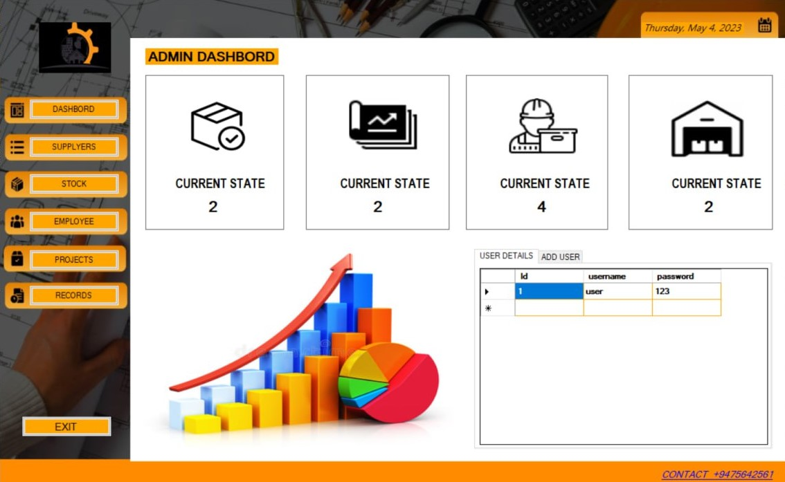
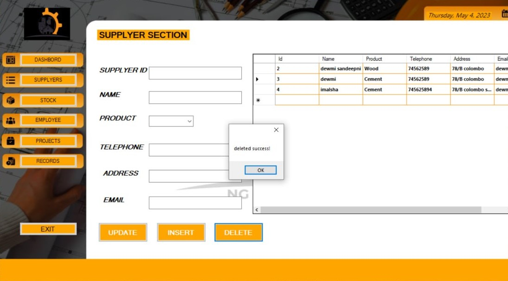
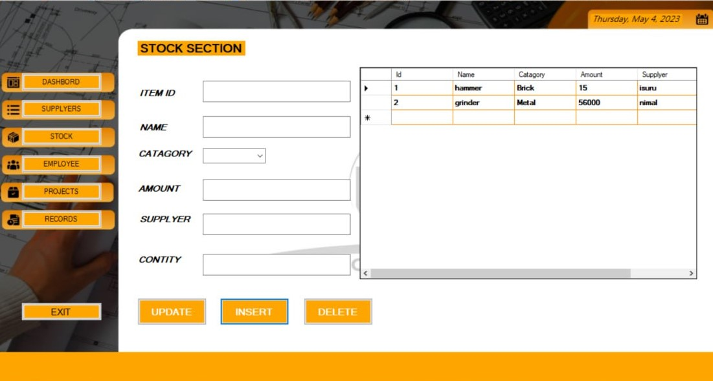
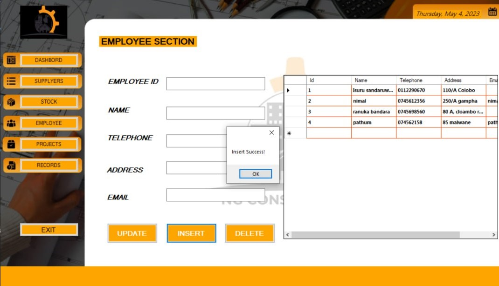
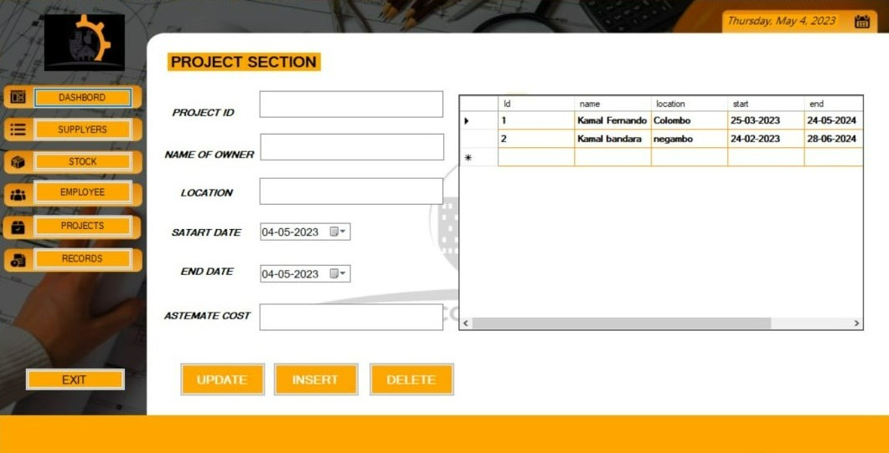
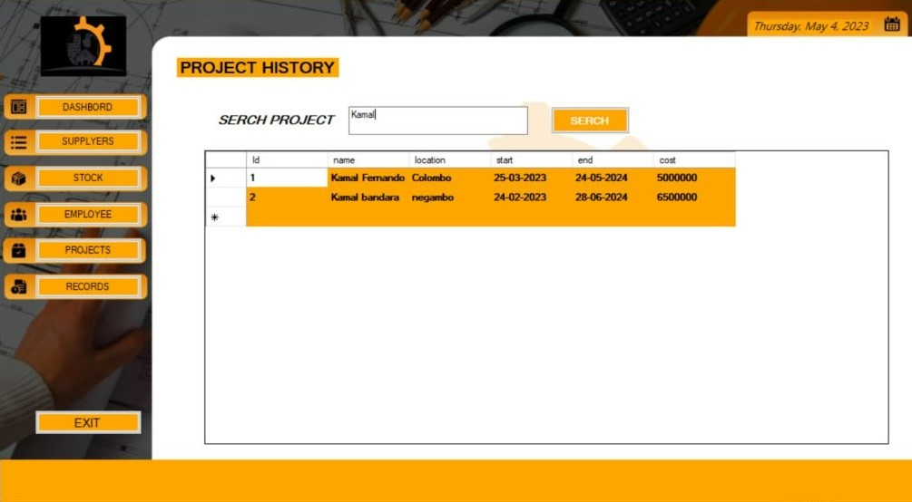
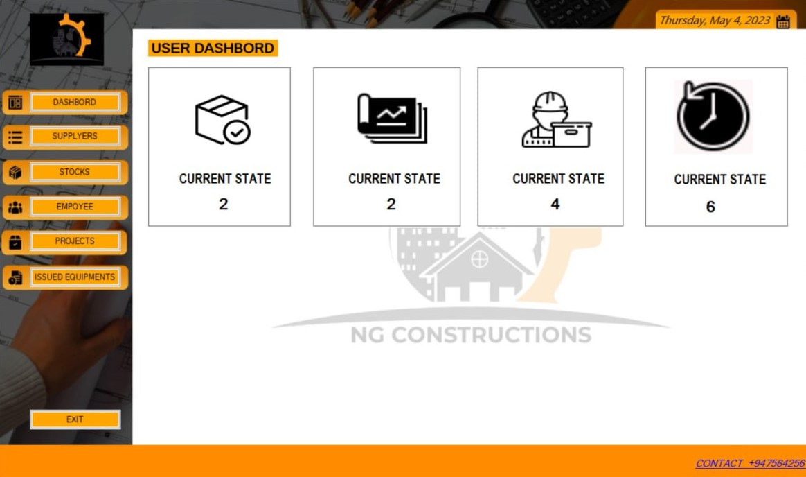

#  

 

# INTRODUCTION 

NG Construction is a company established in 2021 by Sri Lankan entrepreneurs, specializing in designing, planning, and managing building projects of various sizes. Their team comprises over 50 employees, including permanent and contract-based staff, such as architects, project managers, constructors, technical experts, and workers. The organization's ultimate goal is to ensure project success by prioritizing safety, efficiency, and high-quality standards. They strive to deliver better quality projects to the world and achieve customer satisfaction.

As a developing organization, NG Construction has decided to optimize its workload and streamline its processes by converting their manual process into a systemized one. To achieve this goal, the team has evaluated the current processes and environment and created a new system with additional features to simplify their day-to-day tasks. The new system will replace the manual process and enable the team to complete their tasks with ease and accuracy.

 

1- Required software:
* Visuel Studio
* .Net Framework 4.8 
* XAMPP or Wamp (optional)
* Windows Support OS

2-Interfacse

>Lording

*ADMIN SECTION

>Admin Login

>Dashbord

>Suppyers

>Stock

>Employee

>Projects

>History Records

*USER SECTION

>User Login

>Dashbord

>Supplyers

>Stock

>Employee

>Projects

>Issued Items

